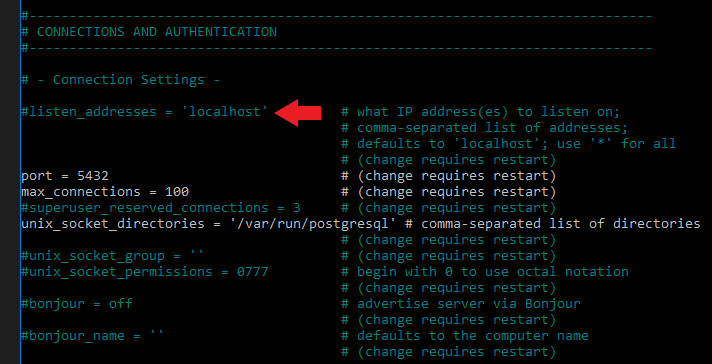
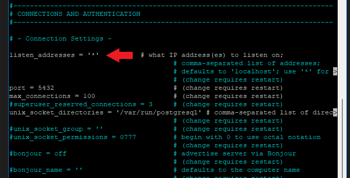
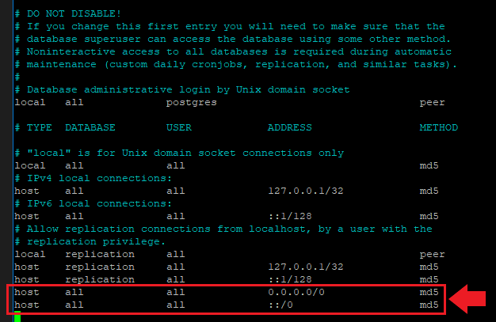

# Postgres Remote Configuration

readme based on: https://www.bigbinary.com/blog/configure-postgresql-to-allow-remote-connection

---
## Server IP: postgresql.conf
the postgresql.conf file tells postgres how to setup the server. we will edit this file to change the IP from the default local host to our server's public IP

file edit and default location:
```
sudo nano /etc/postgresql/12/main/postgresql.conf
```
You will have to scroll down a bit.

Change: 

> listen_addresses = 'localhost' 



To: 
```
listen_addresses = '*' 
```
<br>


---
## Allowing remote connections: pg_hba.conf
the pg_hba.conf file tells postgres who to allow to connect to the database and what authentication method is used.
```
sudo nano /etc/postgresql/12/main/pg_hba.conf
```
<br>
We need to add these two lines to allow all remote connections from IPv4 and IPv6 addresses. 
```
host    all             all             0.0.0.0/0               md5
```
```
host    all             all             ::/0                    md5
```


---
### Don't Forget!
After doing both, restart your postgresql server:
```
sudo service postgresql restart
```