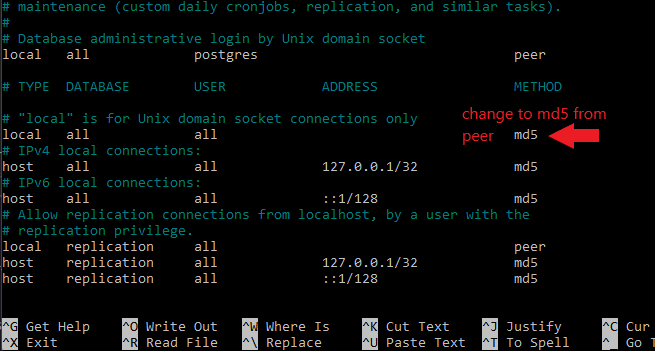
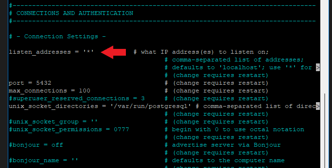
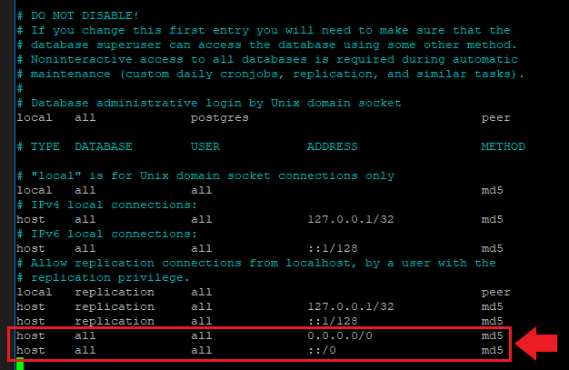

# How to postgres
---

# postgres install

```
sudo sh -c 'echo "deb http://apt.postgresql.org/pub/repos/apt $(lsb_release -cs)-pgdg main" > /etc/apt/sources.list.d/pgdg.list' 
```

```
wget --quiet -O - https://www.postgresql.org/media/keys/ACCC4CF8.asc | sudo apt-key add -
```

```
sudo apt-get update
```

```
sudo apt-get -y install postgresql-12
```
---
---
# postgres setup
## postgres terminal


cheat sheet: 
>https://gist.github.com/Kartones/dd3ff5ec5ea238d4c546
```
sudo -u postgres psql
```

## postgres service commands
```
sudo service postgresql stop
sudo service postgresql start
sudo service postgresql restart
```
---
## user/role creation
- you need to create the roles/users that your application uses to connect to the postgres database
- Password goes inside quotes

```
create role NAMEGOESHERE with superuser login password 'PASSWORDHEREKEEPQUOTES';
```
---
## create database
```
create database DBNAMEGOESHERE;
```
---
# database duplicatation

### Docs:
> https://www.postgresql.org/docs/12/app-pgdump.html <br>
> https://www.postgresql.org/docs/12/backup-dump.html
---
### Database dump:
create a dump file whichcontains all the commands to recreate the entire database from scratch

```
pg_dump dbname > dumpfile
```
- plain terrminal (not psql terminal)
- file will output to your current directory
- warning: if you don't specify the output file it will log the output to your screen INSTEAD of a file

---
### import dumpfile
```
psql dbname < filename
```
---
### fix for password connection
The config file for connecting to postgres needs to be updated to md5 from peer for local connections. This may interfere with creating the database. Peer checks if your username in terminal/ubuntu is the same as postgres username. Md5 means you need to login with password.
```
sudo nano /etc/postgresql/12/main/pg_hba.conf
```

<br>

-----


# Postgres Remote Configuration

readme based on: https://www.bigbinary.com/blog/configure-postgresql-to-allow-remote-connection

---
## Server IP: postgresql.conf
the postgresql.conf file tells postgres how to setup the server. we will edit this file to change the IP from the default local host to our server's public IP

file edit and default location:
```
sudo nano /etc/postgresql/12/main/postgresql.conf
```
You will have to scroll down a bit.

Change: 

> listen_addresses = 'localhost' 


To: 
```
listen_addresses = '*' 
```
<br>


---
## Allowing remote connections: pg_hba.conf
the pg_hba.conf file tells postgres who to allow to connect to the database and what authentication method is used.
```
sudo nano /etc/postgresql/12/main/pg_hba.conf
```
<br>
We need to add these two lines to allow all remote connections from IPv4 and IPv6 addresses. 
```
host    all             all             0.0.0.0/0               md5
```
```
host    all             all             ::/0                    md5
```


---
### Don't Forget!
After doing both, restart your postgresql server:
```
sudo service postgresql restart
```